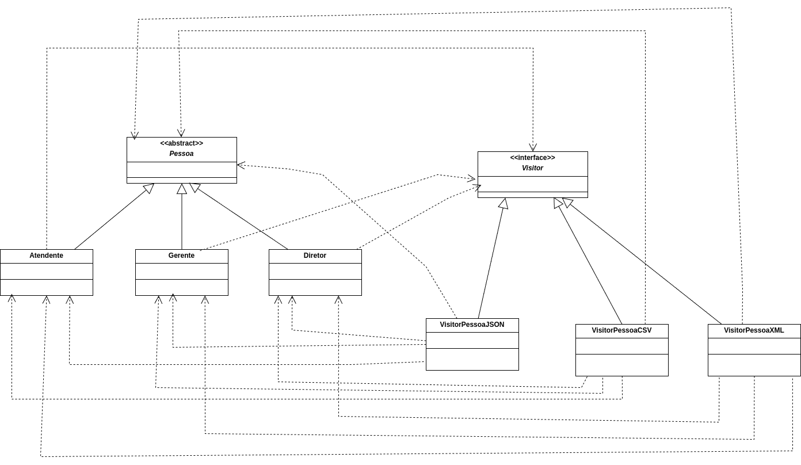

# Sistema de Estrutura Empresarial - Padrão de Projeto Visitor

Este sistema modela uma estrutura empresarial utilizando o padrão de projeto **Visitor**. O objetivo do padrão é permitir processar informações dos funcionários em diferentes formatos (JSON, CSV, XML) sem alterar as classes de cada tipo de pessoa.

---

## Diagrama de Classes

---
